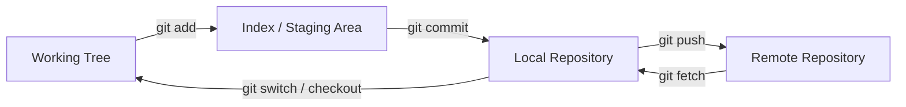

# 2. Core Concepts — The "Why" Behind Everything

This section builds the foundational Git model: working tree, index, repository, commits, branches, HEAD, remotes, integration, and diffs.

## 2.1 Working Directory / Working Tree

- The files you are currently editing form the working state of your project.
- Git commonly calls this the **working tree** or **working directory**.
- Changes can exist here before being staged or committed.

### Visual

```
Repository
  |
  | checkout / switch
  v
Working Tree
  |
  | edit files
  v
Modified files

```

### Related commands

- `git status`
- `git add`
- `git restore`
- `git checkout`

## 2.2 Staging Area / Index

- `git add` places selected changes into Git's tracking/staging process.
- The technical name for the staging area is the **index**.
- The index is a proposed snapshot of what the next commit should contain.
- You can stage some files or even specific hunks without committing everything.

```
Working Tree
  |
  | git add
  v
Index / Staging Area

```

## 2.3 Repository

- A repository is where Git tracks project history.
- Running `git init` creates a Git repository in a directory.
- Git creates a hidden `.git` directory.
- You generally do not need to manually modify `.git`.
- `.git` stores Git's internal metadata, objects, references, configuration, and history.
- A `.git` directory makes the containing directory a working tree for that repository.

## 2.4 `.git`

- `.git` is created when a repository is initialized.
- It contains information used by Git to manage history, branches, and other repository state.
- Important internal areas can include `objects`, `refs`, `HEAD`, `index`, and repository configuration.
- Corrupting `.git` can corrupt the repository, so manual editing should generally be avoided unless you understand the internal structure.

## 2.5 Commit

- A commit is like a checkpoint or snapshot.
- A commit records who made the change, when, and the commit message.
- Git assigns a commit hash.
- Technically, a commit object records metadata such as author, committer, message, parent commit(s), and a tree representing the file state.
- A commit does not literally duplicate every file into a new independent folder.
- Git uses content-addressed objects and reuses unchanged data.

```
Commit C3
 |
 +--> Parent: C2
 +--> Tree: project state
 +--> Author
 +--> Committer
 +--> Message

```

## 2.6 Commit hash

- Git displays a hash for each commit in `git log`.
- The hash uniquely identifies a commit in practical repository operations.
- A full hash is typically represented as a long hexadecimal object ID.
- Short hashes such as the first 7–12 characters are commonly used when they are unambiguous.

## 2.7 Branch

- A branch can be understood as a parallel line of development for the project.
- A feature branch lets you work independently from `main`.
- More precisely, a branch is a **movable reference pointing to a commit**.
- Creating a branch does not duplicate the entire repository.
- New commits move the branch reference forward.

```
main
 |
 v
A---B---C
     \
     D---E  feature

```

## 2.8 `main`

- `main` is shown as the modern default primary branch name.
- Older repositories often used `master`.
- The branch name itself is not technically special to Git; teams can configure different default names.
- `main` is a common convention.

## 2.9 HEAD

- `HEAD` is described as a pointer referring to the currently checked-out position.
- When the current branch receives a new commit, `HEAD` normally follows that branch.
- In normal operation, `HEAD` points to a branch reference, which points to a commit.
- In detached HEAD state, `HEAD` points directly to a commit instead of a local branch.

```
HEAD
 |
 v
main
 |
 v
C3

```

## 2.10 Detached HEAD

- Checking out a specific commit hash puts the repository into **detached HEAD** state.
- This is useful for viewing an older snapshot.
- The existing history is not deleted.
- You can later return with `git checkout main`.
- If you make valuable commits while detached, create a branch before losing track of them.
- Detached HEAD is useful for inspecting, testing, debugging, and temporarily experimenting with historical states.

```
HEAD ─────> C2
      ^
      |
main ─────> C5

HEAD is not attached to `main`.

```

## 2.11 Remote

- A remote is a repository reference for another Git repository, typically on a server.
- GitHub hosts remote repositories.
- A remote is stored as a named URL configuration.
- A repository may have more than one remote.

## 2.12 `origin`

- `origin` is the default name Git gives to the remote repository when cloning.
- A remote can be added with `git remote add origin <URL>`.
- `origin` is only a conventional name, not a reserved keyword.
- You can rename it or have additional remotes such as `upstream`.

## 2.13 Upstream branch

- `git push -u origin feature-branch` creates a relationship between the local and remote branch.
- Future pushes can then often use only `git push`.
- An upstream branch is the tracking counterpart configured for a local branch.
- `git branch -vv` can show tracking information.

## 2.14 Merge

- Merging combines changes from one branch into another.
- A feature branch can be merged through a GitHub pull request.
- `git merge main` is used to bring `main` into a feature branch during conflict resolution.
- A merge may produce a merge commit when Git cannot fast-forward.
- Fast-forward merges do not need an extra merge commit.

```
A---B---C main
   \
   D---E feature

merge feature into main

A---B---C------M main
   \     /
   D-------E

```

## 2.15 Rebase

- Rebase reapplies commits from one branch onto a new base.
- It rewrites commit history by creating new commit identities.
- Rebase is useful for keeping a feature branch current or producing a cleaner linear history.
- Rebase should be used carefully on commits already shared with others.

```
Before:

A---B---C main
   \
   D---E feature

After rebase:

A---B---C---D'---E' feature

```

## 2.16 Pull request

- A pull request lets a team share changes for review before merging.
- Reviewers can inspect changes, comment, request changes, and merge the branch.
- A pull request is a Git hosting workflow feature, not a core Git command.
- GitHub adds collaboration features around normal Git operations.

## 2.17 Merge conflict

- A merge conflict occurs when Git cannot determine how competing changes should be combined automatically.
- A typical conflict example is modifying the same line in `readme.md` on two branches.
- The branch merged first changes `main`; the second PR then conflicts.
- The developer updates local `main`, switches to the feature branch, and merges `main` into that feature branch to resolve the conflict before completing the PR.
- Conflicts can occur in text files, renamed files, deleted/modified files, binary files, and more complex structural situations.
- The conflict must be resolved in the working tree and then staged and committed.

## 2.18 Diff

- A diff is the exact set of changes between two states.
- Diffs are fundamental to pull requests and code review.
- `git diff` compares working-tree changes against the index by default.
- `git diff --staged` compares staged changes against the last commit.

## 2.19 Snapshot vs pointer

- Keep this distinction clear:

| Concept What it is   |                           |
| ---------------------- | ---------------------------------------------------- |
| Commit         | Historical object describing a project state     |
| Branch         | Movable name pointing to a commit          |
| HEAD          | Reference to current checkout            |
| Tag          | Usually a fixed name pointing to a specific object  |
| Remote-tracking branch | Local reference showing the state of a remote branch |

## 2.20 Index vs working tree vs repository



- This is the foundational mental model behind most daily Git commands.

> Additional context: The precise roles of the index, commit object, branch reference, remote-tracking branch, diff, and rebase are included so the practical behavior maps to Git's underlying mechanics.

---

# 3. Setup & First-Time Config
