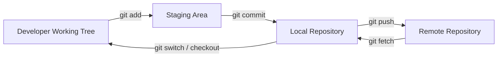

# 5. Visual Walkthroughs — Recreate the Source material's Diagrams

This section preserves the visual models used to understand repository initialization, local and remote flows, branching, pull requests, conflicts, undo operations, stash, and GUI workflows.

## 5.1 Version-control problem without Git

- Imagine several folders:

```
my project
my project V1
my project V2
my project V3
my project V4
John's changes.zip

```

- The developer manually compares and combines these folders.
- The key problem is that there is no structured history or reliable collaboration model.

## 5.2 Git repository initialization

- Visual state:

```
mastering-git/
├── hello.js
├── readme.md
└── .git/

```

- The hidden `.git` folder is what turns the directory into a Git repository.
- The working files remain normal files; Git's internal data is stored separately.

## 5.3 Basic local lifecycle

- The basic workflow can be visualized as:

```
Create / edit file
   |
   v
Working Directory
   |
 git add
   v
Staging Area
   |
 git commit
   v
Commit History

```

## 5.4 Local + remote



## 5.5 Branch diagram

- Imagine `main` and `feature` as parallel lines diverging from a shared commit.

```
A---B---C main
   \
   D---E feature

```

- `feature` can evolve while `main` remains stable.

## 5.6 Pull request diagram

```
feature branch
   |
   | push
   v
remote feature
   |
   | Pull Request
   v
review
   |
   | merge
   v
main

```

- The PR acts as the review gate before changes enter the main branch.

## 5.7 Conflict diagram

```
        main
         |
A---B------------C
   \
   D-----------E feature

C changes the same line that E changes.
     |
     v
   CONFLICT

```

- One conflict-resolution workflow is to update local `main`, switch to `feature`, and run:

```bash
git merge main

```

- The conflict resolution is then staged, committed, and pushed.

## 5.8 Conflict editor model

- The WebStorm interface shows: 
 - Left side = current branch changes.
 - Right side = `main` changes.
 - Middle = resulting file.
- The developer can select one side or combine both.

## 5.9 Reset visual

```
C1---C2---C3---C4---C5
     ^
     target

git reset --mixed C2

branch --> C2
working tree contains changes from C3-C5
index does not stage them

```

- A mixed reset removes commits from the current branch history while keeping the corresponding file changes available in the working tree.

## 5.10 Revert visual

```
C1---C2---C3
     |
     | git revert C3
     v
C1---C2---C3---C4
        ^
     C4 reverses C3

```

- The original bad commit remains visible in history.
- This makes revert appropriate for shared/public history.

## 5.11 Stash visual

```
Feature work in progress
     |
   git stash
     v
Clean working tree
     |
    urgent fix
     |
   git commit
     |
  git stash apply
     v
Feature work restored

```

## 5.12 Git GUI flow

- WebStorm visually exposes: 
 - branch selection
 - commit
 - push
 - update/pull
 - history
 - merge
 - pull requests
 - conflict resolution
 - cherry-pick
 - revert
 - branch deletion
 - branch comparison

> Additional context: Explicit diagrams for the index, rebase, revert, and recovery concepts make these relationships easier to retain visually.

---

# 6. Workflows
