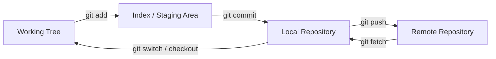
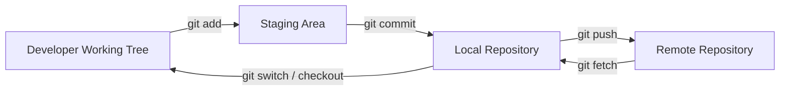

# Git & GitHub — Master Notes

---

## Contents

1. Big Picture — Why Git & GitHub Exist
2. Core Concepts — The "Why" Behind Everything
3. Setup & First-Time Config
4. Command Playbook — Detailed Reference
5. Visual Models
6. Workflows
7. Practical Scenarios
8. Glossary
9. Interview Preparation
10. Practice / Action Items

## Learning Goals

- Git is a **distributed version control system** used to track code changes, preserve history, and support collaboration.
- GitHub is a **cloud platform for hosting Git repositories and collaborating** with other developers.
- The core local Git model is **Working Directory → Staging Area/Index → Repository**.
- A **commit** is a permanent historical record of a project state; a **branch** is a movable reference to commits.
- Branches let multiple developers work independently without immediately changing `main`.
- Pull requests provide a review-and-merge workflow on GitHub.
- Merge conflicts happen when Git cannot automatically reconcile competing changes.
- `git reset`, `git revert`, `git restore`, `git checkout`, and `git stash` solve different kinds of "I need to undo or temporarily move changes" problems.
- `git rebase`, `git reflog`, `git fetch`, `git cherry-pick`, tags, `.gitignore`, worktrees, submodules, and bisect fill important gaps for professional Git usage.
- A GUI such as WebStorm can perform Git operations visually, but understanding the underlying Git model remains essential.

---

# 1. Big Picture — Why Git & GitHub Exist

## 1.1 The problem Git solves

- Imagine developing inside one folder such as `my project`.
- Without Git, you may create manual versions such as `my project V1`, `V2`, `V3`, and so on.
- When another developer makes changes, you may exchange ZIP files such as `my project V3 John changes.zip`.
- You then manually compare versions and create another combined version.
- If you later discover that a feature disappeared in an older version, you have to search through old folders to determine what changed.
- With many developers, this workflow becomes chaotic, slow, and error-prone.
- Git automates change tracking, preserves history, supports parallel work, and lets you navigate through previous project states.
- A useful mental model is: **Git replaces chaotic folders such as "final", "final really final", "V3", and ZIP-file exchange with structured version history.**
- Git is an industry-standard developer skill.

## 1.2 Git vs GitHub

| / Concept Meaning Main purpose |                           |                     |
| ------------------------------- | --------------------------------------------------- | ---------------------------------------- |
| Git               | Distributed Version Control System         | Track and manage project history     |
| GitHub             | Cloud platform built around Git repositories    | Host repositories and collaborate online |
| Local repository        | Git repository on your machine           | Local development and history      |
| Remote repository        | Repository hosted on a server            | Sharing and synchronization       |
| `origin`            | Conventional remote name              | Short alias for a remote URL       |
| Upstream branch         | Remote branch tracked by a local branch       | Simplifies future push/pull operations  |
| Git object database       | Internal storage of commits, trees, blobs, and tags | Stores Git's actual history       |
| GitHub PR            | A collaboration/review mechanism          | Review and merge proposed changes    |

- Git itself does not require GitHub.
- A local Git repository can exist entirely offline.
- GitHub is one possible remote host.
- Other remote hosts include GitLab, Bitbucket, self-hosted Git servers, and cloud DevOps platforms.

## 1.3 Centralized vs distributed version control

| Model Architecture Example Main characteristic |                     |   |                       |
| ----------------------------------------------- | --------------------------------------- | --- | ------------------------------------------- |
| Centralized VCS                 | One authoritative central repository  | SVN | Developers depend heavily on central server |
| Distributed VCS                 | Every clone contains repository history | Git | Developers have a complete local repository |

- In a distributed system, many Git operations work without network access.
- `git log`, `git diff`, branching, commits, and many recovery operations can work locally.
- Network access is primarily required when synchronizing with a remote or interacting with remote services.

## 1.4 Mental Model

- Think of committing as taking a **snapshot/checkpoint** of a project.
- Commits act as points in history to which you can effectively "time travel".
- Branches can be understood as parallel lines of development for the project.
- A stash temporarily puts unfinished work aside so you can handle something urgent.
- Git provides a traceable history that helps determine what changed when work is lost or broken.
- Git becomes especially valuable when production breaks because history makes investigation and recovery possible.

## 1.5 Visual model

- Recreate the basic local Git diagram as three boxes:

```
Working Directory
    |
   git add
    v
Staging Area / Index
    |
  git commit
    v
Local Repository

```

- Remote collaboration adds another repository:

```
Working Directory
    |
  git add
    v
Staging Area
    |
 git commit
    v
Local Repository
    |
 git push / fetch
    v
Remote Repository
    ^
    |
 git pull

```

## 1.6 Why history matters

- Regular commits make progress easier to track.
- Previous versions can be inspected when something breaks.
- Bad changes can be reverted or reset depending on the situation.
- Git history is also valuable for code review, auditing, debugging, release management, and identifying regressions.

> **Do not treat Git as merely a way to upload code. It is the version-control system underneath your entire development workflow.**

> Additional context: Centralized-vs-distributed architecture and a more precise repository model clarify what makes Git a distributed version-control system.

---

# 2. Core Concepts — The "Why" Behind Everything

## 2.1 Working Directory / Working Tree

- The files you are currently editing form the working state of your project.
- Git commonly calls this the **working tree** or **working directory**.
- Changes can exist here before being staged or committed.

### Visual

```
Repository
  |
  | checkout / switch
  v
Working Tree
  |
  | edit files
  v
Modified files

```

### Related commands

- `git status`
- `git add`
- `git restore`
- `git checkout`

## 2.2 Staging Area / Index

- `git add` places selected changes into Git's tracking/staging process.
- The technical name for the staging area is the **index**.
- The index is a proposed snapshot of what the next commit should contain.
- You can stage some files or even specific hunks without committing everything.

```
Working Tree
  |
  | git add
  v
Index / Staging Area

```

## 2.3 Repository

- A repository is where Git tracks project history.
- Running `git init` creates a Git repository in a directory.
- Git creates a hidden `.git` directory.
- You generally do not need to manually modify `.git`.
- `.git` stores Git's internal metadata, objects, references, configuration, and history.
- A `.git` directory makes the containing directory a working tree for that repository.

## 2.4 `.git`

- `.git` is created when a repository is initialized.
- It contains information used by Git to manage history, branches, and other repository state.
- Important internal areas can include `objects`, `refs`, `HEAD`, `index`, and repository configuration.
- Corrupting `.git` can corrupt the repository, so manual editing should generally be avoided unless you understand the internal structure.

## 2.5 Commit

- A commit is like a checkpoint or snapshot.
- A commit records who made the change, when, and the commit message.
- Git assigns a commit hash.
- Technically, a commit object records metadata such as author, committer, message, parent commit(s), and a tree representing the file state.
- A commit does not literally duplicate every file into a new independent folder.
- Git uses content-addressed objects and reuses unchanged data.

```
Commit C3
 |
 +--> Parent: C2
 +--> Tree: project state
 +--> Author
 +--> Committer
 +--> Message

```

## 2.6 Commit hash

- Git displays a hash for each commit in `git log`.
- The hash uniquely identifies a commit in practical repository operations.
- A full hash is typically represented as a long hexadecimal object ID.
- Short hashes such as the first 7–12 characters are commonly used when they are unambiguous.

## 2.7 Branch

- A branch can be understood as a parallel line of development for the project.
- A feature branch lets you work independently from `main`.
- More precisely, a branch is a **movable reference pointing to a commit**.
- Creating a branch does not duplicate the entire repository.
- New commits move the branch reference forward.

```
main
 |
 v
A---B---C
     \
     D---E  feature

```

## 2.8 `main`

- `main` is shown as the modern default primary branch name.
- Older repositories often used `master`.
- The branch name itself is not technically special to Git; teams can configure different default names.
- `main` is a common convention.

## 2.9 HEAD

- `HEAD` is described as a pointer referring to the currently checked-out position.
- When the current branch receives a new commit, `HEAD` normally follows that branch.
- In normal operation, `HEAD` points to a branch reference, which points to a commit.
- In detached HEAD state, `HEAD` points directly to a commit instead of a local branch.

```
HEAD
 |
 v
main
 |
 v
C3

```

## 2.10 Detached HEAD

- Checking out a specific commit hash puts the repository into **detached HEAD** state.
- This is useful for viewing an older snapshot.
- The existing history is not deleted.
- You can later return with `git checkout main`.
- If you make valuable commits while detached, create a branch before losing track of them.
- Detached HEAD is useful for inspecting, testing, debugging, and temporarily experimenting with historical states.

```
HEAD ─────> C2
      ^
      |
main ─────> C5

HEAD is not attached to `main`.

```

## 2.11 Remote

- A remote is a repository reference for another Git repository, typically on a server.
- GitHub hosts remote repositories.
- A remote is stored as a named URL configuration.
- A repository may have more than one remote.

## 2.12 `origin`

- `origin` is the default name Git gives to the remote repository when cloning.
- A remote can be added with `git remote add origin <URL>`.
- `origin` is only a conventional name, not a reserved keyword.
- You can rename it or have additional remotes such as `upstream`.

## 2.13 Upstream branch

- `git push -u origin feature-branch` creates a relationship between the local and remote branch.
- Future pushes can then often use only `git push`.
- An upstream branch is the tracking counterpart configured for a local branch.
- `git branch -vv` can show tracking information.

## 2.14 Merge

- Merging combines changes from one branch into another.
- A feature branch can be merged through a GitHub pull request.
- `git merge main` is used to bring `main` into a feature branch during conflict resolution.
- A merge may produce a merge commit when Git cannot fast-forward.
- Fast-forward merges do not need an extra merge commit.

```
A---B---C main
   \
   D---E feature

merge feature into main

A---B---C------M main
   \     /
   D-------E

```

## 2.15 Rebase

- Rebase reapplies commits from one branch onto a new base.
- It rewrites commit history by creating new commit identities.
- Rebase is useful for keeping a feature branch current or producing a cleaner linear history.
- Rebase should be used carefully on commits already shared with others.

```
Before:

A---B---C main
   \
   D---E feature

After rebase:

A---B---C---D'---E' feature

```

## 2.16 Pull request

- A pull request lets a team share changes for review before merging.
- Reviewers can inspect changes, comment, request changes, and merge the branch.
- A pull request is a Git hosting workflow feature, not a core Git command.
- GitHub adds collaboration features around normal Git operations.

## 2.17 Merge conflict

- A merge conflict occurs when Git cannot determine how competing changes should be combined automatically.
- A typical conflict example is modifying the same line in `readme.md` on two branches.
- The branch merged first changes `main`; the second PR then conflicts.
- The developer updates local `main`, switches to the feature branch, and merges `main` into that feature branch to resolve the conflict before completing the PR.
- Conflicts can occur in text files, renamed files, deleted/modified files, binary files, and more complex structural situations.
- The conflict must be resolved in the working tree and then staged and committed.

## 2.18 Diff

- A diff is the exact set of changes between two states.
- Diffs are fundamental to pull requests and code review.
- `git diff` compares working-tree changes against the index by default.
- `git diff --staged` compares staged changes against the last commit.

## 2.19 Snapshot vs pointer

- Keep this distinction clear:

| Concept What it is   |                           |
| ---------------------- | ---------------------------------------------------- |
| Commit         | Historical object describing a project state     |
| Branch         | Movable name pointing to a commit          |
| HEAD          | Reference to current checkout            |
| Tag          | Usually a fixed name pointing to a specific object  |
| Remote-tracking branch | Local reference showing the state of a remote branch |

## 2.20 Index vs working tree vs repository



- This is the foundational mental model behind most daily Git commands.

> Additional context: The precise roles of the index, commit object, branch reference, remote-tracking branch, diff, and rebase are included so the practical behavior maps to Git's underlying mechanics.

---

# 3. Setup & First-Time Config

## 3.1 Installing Git

- Git must be installed before using Git from the terminal.
- Install the Git version appropriate for your operating system from the official Git distribution.
- On Windows, Git for Windows provides Git Bash and command-line Git.
- On macOS, Git can be installed through Xcode Command Line Tools or package managers.
- On Linux, Git is normally available through the distribution package manager.

## 3.2 Verify installation — `git --version` 

> What it does: Displays the installed Git version.

**Usage:**

```bash
git --version

```

**Example:**

```bash
git --version

```

**When to use:**

- Use immediately after installing Git.
- Use when troubleshooting which Git installation your shell is using.

**Common options / notes:**

- `-version` is the standard global version flag.

**Gotcha:**

- If the command is not found, Git is either not installed or not available on the system `PATH`.

> ❓ If a copied command appears as `git D- version` or another malformed variant, the correct command is `git --version`.

## 3.3 Configure user name — `git config --global user.name` 

> What it does: Configures the name Git records in commits.

**Usage:**

```bash
git config --global user.name "Your Name"

```

**Example:**

```bash
git config --global user.name "Yeshwanth"

```

**When to use:**

- During initial Git setup.

**Common options:**

- `-global` applies the setting to the current user's Git configuration.
- Without `-global`, the configuration applies only to the current repository.

**Gotcha:**

- This identity is commit metadata; it is not itself an authentication credential for GitHub.

## 3.4 Configure email — `git config --global user.email` 

> What it does: Configures the email Git records in commits.

**Usage:**

```bash
git config --global user.email "you@example.com"

```

**Example:**

```bash
git config --global user.email "you@example.com"

```

**When to use:**

- During initial Git setup.

**Common options:**

- `-global` applies the setting for your user account.
- Repository-specific configuration can omit `-global`.

**Gotcha:**

- GitHub may associate commits with your GitHub account based on email matching and repository/account configuration.

## 3.5 Configure default branch — `git config --global init.defaultBranch` 

> What it does: Sets the default branch name used for newly initialized repositories.

**Usage:**

```bash
git config --global init.defaultBranch main

```

**Example:**

```bash
git config --global init.defaultBranch main

```

**When to use:**

- Configure `main` as the initial branch name.
- Set this once so future `git init` repositories consistently start on `main`.

**Gotcha:**

- This affects newly initialized repositories; it does not rename an existing branch.

## 3.6 Inspect configuration — `git config --list` 

> What it does: Displays Git configuration settings.

**Usage:**

```bash
git config --list

```

**Example:**

```bash
git config --global --list

```

**When to use:**

- Use when debugging Git identity, aliases, credential helpers, default branch settings, or other configuration.

**Common options:**

```bash
git config --global --list
git config --local --list
git config --system --list

```

**Gotcha:**

- More specific configuration levels override broader ones.

## 3.7 Configuration levels

| Level Scope |                |
| ------------ | ----------------------------- |
| `--system`  | Whole machine         |
| `--global`  | Current operating-system user |
| `--local`  | Current repository      |

## 3.8 SSH authentication 

> What it does: Lets Git authenticate to supported remotes using an SSH key pair rather than repeatedly supplying HTTPS credentials.

**Typical flow:**

```bash
ssh-keygen -t ed25519 -C "you@example.com"
ssh-add ~/.ssh/id_ed25519

```

**Example remote:**

```bash
git@github.com:username/repository.git

```

**When to use:**

- Recommended when you frequently interact with GitHub over SSH.

**Gotchas:**

- Never publish the private key.
- The public key is safe to add to Git hosting.
- SSH setup differs slightly by operating system and shell.

## 3.9 HTTPS + PAT authentication 

- GitHub no longer uses an account password as the normal HTTPS Git authentication mechanism.
- A **Personal Access Token (PAT)** can be used where password-style authentication is requested by a credential flow.
- Git credential managers can securely cache authentication.

> Never commit access tokens, API keys, SSH private keys, or other credentials into a repository.

## 3.10 Setup checklist

- [ ] Install Git.
- [ ] Verify with `git --version`.
- [ ] Configure `user.name`.
- [ ] Configure `user.email`.
- Configure `main` as the default branch.
- Configure authentication with SSH or HTTPS credentials.
- Verify configuration.
- Verify GitHub access with a test repository.

> Additional context: SSH, HTTPS/PAT authentication, configuration inspection, and configuration-scope precedence are included to make first-time Git setup complete.

---

# 4. Command Playbook — Detailed Reference

This section is the practical command reference. The goal is not to memorize flags mechanically. For each command, understand the state Git reads, the state it changes, and the situations in which the command is appropriate.

A useful rule before running an unfamiliar command:

```text
1. Check the current state → git status
2. Inspect the change/history if necessary
3. Decide which Git state you want
4. Use the command that moves you there
5. Check git status again
```

## 4.1 `git init`

`git init` creates a new Git repository in a directory. It creates Git's administrative data, normally inside `.git/`, while leaving your existing project files where they are.

```bash
git init
git init <directory>
git init --initial-branch=main
git init -b main
```

### Common forms

```bash
git init
```
Initializes the current directory.

```bash
git init my-project
```
Creates the directory if necessary and initializes a repository there.

```bash
git init -b main
```
Initializes the repository with `main` as the initial branch.

```bash
git init --bare
```
Creates a **bare repository**. A bare repository has no normal working tree and is commonly used as a server-side repository or central remote.

### What changes internally

Before `git init`, the directory is just an ordinary directory.

After `git init`, Git creates repository metadata such as:

```text
project/
├── your files
└── .git/
```

The `.git` directory contains the repository's object database, references, index, configuration, `HEAD`, logs, and other internal state.

### Important edge cases

- Running `git init` inside an existing repository generally reinitializes the existing repository rather than creating a second independent repository.
- If you initialize a repository in a directory that is already inside another repository, Git normally operates with the nearest repository unless a nested repository is deliberately created.
- `git init --bare` is different from normal initialization because there is no working tree for ordinary file editing.

---

## 4.2 `git clone`

`git clone` creates a new local repository from an existing repository. It normally downloads repository objects, creates a working tree, configures `origin`, and checks out the repository's default branch.

```bash
git clone <url>
git clone <url> <directory>
```

### Important variations

```bash
git clone --branch <branch> <url>
git clone -b <branch> <url>
```
Clone and check out a particular branch.

```bash
git clone --single-branch --branch develop <url>
```
Clone only the requested branch instead of fetching the normal set of branch refs.

```bash
git clone --depth 1 <url>
```
Create a shallow clone containing limited history. Useful for CI or situations where complete history is unnecessary.

```bash
git clone --depth 10 <url>
```
Keep a specified amount of recent history.

```bash
git clone --no-checkout <url>
```
Clone the repository without initially checking out files into the working tree.

```bash
git clone --bare <url>
```
Create a bare clone, normally used for repository hosting or server-side operations.

```bash
git clone --mirror <url>
```
Create a mirror containing all refs. This is mainly used for repository mirroring/backup rather than normal development.

```bash
git clone --recurse-submodules <url>
```
Clone the repository and initialize its submodules recursively.

### What happens after cloning

A normal clone gives you approximately:

```text
Remote repository
    ↓ clone
Local repository + working tree
    ↓
origin → remote repository URL
```

The remote-tracking branch `origin/main` represents the last fetched state of the remote's `main` branch. Your local `main` is a separate local branch.

### Common mistakes

- `git clone` is normally used when the repository already exists remotely. `git init` is normally used when starting a new local repository.
- `--depth 1` is not a full-history clone; some history-dependent operations may be limited until more history is fetched.
- A cloned repository does not mean every future remote update automatically appears locally. You still need `fetch`, `pull`, or another integration workflow.

---

## 4.3 `git status`

`git status` reports the current repository state. It is one of the safest and most useful commands in Git because it tells you what Git believes is happening before you perform another operation.

```bash
git status
git status --short
git status --branch
git status --short --branch
git status --porcelain
git status --porcelain=v1
git status --porcelain=v2
```

### What `git status` tells you

Depending on the situation, it can show:

- current branch
- whether the branch is ahead of or behind its upstream
- modified tracked files
- staged changes
- untracked files
- merge conflicts
- files that have been renamed/deleted
- information about an ongoing merge, rebase, cherry-pick, or other operation

### Working-tree vs staged changes

```text
Changes not staged for commit
```
means the working tree differs from the index.

```text
Changes to be committed
```
means the index differs from the current `HEAD` commit.

```text
Untracked files
```
means Git sees files that are not currently tracked by the repository.

### Short format

```bash
git status --short
```

The compact format is useful when checking status frequently or writing scripts. The two-column status codes distinguish index state from working-tree state.

Example:

```text
 M app.py
M README.md
?? notes.txt
```

Conceptually:

```text
 M → working-tree modification
M → staged modification
?? → untracked
```

### Important habit

If you are unsure what Git is about to do, run:

```bash
git status
git diff
git diff --staged
```

---

## 4.4 `git add`

`git add` updates the **index/staging area** with the content currently present in the working tree. It does not create a commit.

The important mental model is:

```text
Working Tree
   ↓ git add
Index
   ↓ git commit
Commit
```

### Common forms

```bash
git add <file>
git add <directory>
git add .
git add -A
git add --all
git add -u
git add --update
git add -p
git add --patch
```

### `git add <file>`

Stages one specific path.

```bash
git add app.py
```

Useful when you want a focused commit.

### `git add .`

Stages changes under the current directory according to Git's pathspec behavior.

```bash
git add .
```

Do not blindly treat this as identical to every form of `git add -A`; the path from which the command is run matters.

### `git add -A`

Stages additions, modifications, and deletions across the repository.

```bash
git add -A
```

This is useful when you intentionally want the index to represent all current changes.

### `git add -u`

Stages modifications and deletions of already tracked files, but does not stage new untracked files.

```bash
git add -u
```

### Interactive staging

```bash
git add -p
```

Lets you review individual hunks and choose which parts should enter the next commit.

This is extremely useful when one file contains multiple logical changes and you want clean commits.

### Intent-to-add

```bash
git add -N <file>
```

Records that an untracked file should be considered by certain diff/status operations without immediately staging its complete contents.

### Important edge case: file changes after staging

Suppose:

```text
1. edit app.py
2. git add app.py
3. edit app.py again
```

The first version is staged, while the second edit is only in the working tree.

Therefore:

```bash
git diff
```
shows the second edit, while:

```bash
git diff --staged
```
shows the version that is currently staged.

A commit records the staged version, not every current working-tree change.

---

## 4.5 `git commit`

`git commit` creates a new commit from the content currently represented by the index.

A commit records a project state plus metadata such as:

- author
- committer
- timestamps
- commit message
- parent commit(s)
- tree representing the tracked file state

### Basic forms

```bash
git commit
git commit -m "Add login validation"
git commit -a -m "Fix validation"
git commit -am "Fix validation"
```

### `-m`

Supply the commit message directly.

```bash
git commit -m "Add login validation"
```

### `-a` / `-am`

Automatically stage modifications and deletions to already tracked files before committing.

```bash
git commit -am "Fix login validation"
```

It **does not stage new untracked files**.

If `new.py` is untracked, this will not include it:

```bash
git commit -am "Add new functionality"
```

You must first use:

```bash
git add new.py
git commit -m "Add new functionality"
```

### Amend the latest commit

```bash
git commit --amend
```

Replace the latest commit with a new commit using the current index and optionally a new message.

```bash
git commit --amend -m "Correct commit message"
```

Keep the previous message:

```bash
git commit --amend --no-edit
```

Typical use:

```bash
git add forgotten-file.py
git commit --amend --no-edit
```

This changes the latest commit rather than creating another commit.

### Empty commit

```bash
git commit --allow-empty -m "Trigger CI"
```

Creates a commit even when there are no file changes. Useful in specific automation/workflow situations.

### Sign a commit

```bash
git commit -S -m "Add release fix"
git commit --gpg-sign -m "Add release fix"
```

Used when commit signing is configured.

### Fixup commit

```bash
git commit --fixup=<commit>
```

Creates a commit intended to be automatically folded into another commit during an interactive rebase with autosquash.

### What gets committed?

Only the **index** is committed.

```text
Working Tree   → current edits
Index       → selected snapshot
HEAD       → previous commit

 git commit
   ↓
new commit created from Index
```

This is why staging exists: it lets you construct the exact next commit.

---

## 4.6 Commit message style

A good commit message describes the change represented by the commit.

Prefer:

```text
Add login validation
Fix null pointer in payment service
Update API documentation
Remove deprecated endpoint
```

Avoid vague messages:

```text
update
changes
stuff
fix
work
final
```

The imperative style is common because the message can be read as:

```text
If applied, this commit will: Add login validation.
```

Keep commits logically focused. A single commit containing unrelated database changes, UI changes, documentation changes, and dependency upgrades is harder to review and revert.

---

## 4.7 `git log`

`git log` displays commit history. It is one of the primary commands for understanding how the current repository reached its present state.

### Basic forms

```bash
git log
git log --oneline
git log --graph
git log --decorate
git log --all
git log --stat
git log -p
```

### Useful combinations

```bash
git log --oneline --decorate
git log --graph --oneline --decorate --all
git log --stat
git log -p
```

### Limit commits

```bash
git log -n 5
git log --max-count=5
git log --since="1 week ago"
git log --until="2026-09-26"
```

### Filter by author

```bash
git log --author="Yeshwanth"
```

### Search commit messages

```bash
git log --grep="login"
```

### Follow one file

```bash
git log -- path/to/file.py
git log --follow -- path/to/file.py
```

`--follow` can continue history across a file rename in common cases.

### Show branches visually

```bash
git log --graph --oneline --decorate --all
```

This is one of the most useful history commands when learning branches and merges.

### Search by content changes

```bash
git log -S"someFunction"
git log -G"regex-pattern"
```

`-S` searches for changes in the number of occurrences of a string; `-G` searches changed lines using a regular expression.

### Exit the pager

Press:

```text
q
```

---

## 4.8 `git show`

`git show` displays an object, most commonly a commit, and by default shows its metadata and patch.

```bash
git show
 git show HEAD
git show HEAD~1
git show <commit>
```

### Useful variations

```bash
git show --stat <commit>
git show --name-only <commit>
git show --name-status <commit>
git show --format=fuller <commit>
git show --summary <commit>
```

Show a particular file from a commit:

```bash
git show <commit>:path/to/file.py
```

This reads the file as it existed in that commit.

### Why use `git show`?

Use it when `git log` tells you **which commit** you care about and you now want to know **exactly what that commit contained**.

---

## 4.9 `git diff`

`git diff` compares Git states and shows line-level changes.

The most important distinction is what is being compared.

```bash
git diff
```
Working tree vs index.

```bash
git diff --staged
```
Index vs `HEAD`.

```bash
git diff HEAD
```
Working tree + index vs `HEAD`.

### Compare commits

```bash
git diff <commit1> <commit2>
```

### Compare branches

```bash
git diff main..feature
```

This asks for the difference between the two named tips.

For commit-range semantics where you care about changes reachable from one side but not another, understand the difference between two-dot and three-dot notation:

```bash
git diff main..feature
git diff main...feature
```

`main...feature` compares the merge-base of the two branches to `feature`, which is often useful for reviewing what a feature branch introduces relative to its common base.

### File-specific diff

```bash
git diff -- app.py
git diff --staged -- app.py
```

The `--` separates revisions/options from paths.

### Useful options

```bash
git diff --stat
git diff --name-only
git diff --name-status
git diff --word-diff
git diff --color-moved
```

### Practical pre-commit check

```bash
git diff
git diff --staged
git status
```

The first checks what is still unstaged; the second checks exactly what the next commit will contain.

---

## 4.10 `git branch`

A branch is a movable reference to a commit. `git branch` manages local branch references; it does not itself switch the working tree to another branch.

### List branches

```bash
git branch
git branch -a
git branch -r
git branch -vv
```

- `-a` → local + remote-tracking branches
- `-r` → remote-tracking branches
- `-vv` → verbose branch/tracking information

### Create a branch

```bash
git branch feature-login
git branch feature-login main
```

The second form creates `feature-login` starting at `main`'s current commit.

### Rename

```bash
git branch -m new-name
git branch -M new-name
```

`-M` forces the rename if necessary.

Rename another local branch:

```bash
git branch -m old-name new-name
```

### Delete

```bash
git branch -d feature-login
git branch -D feature-login
```

`-d` performs a safety check and normally refuses to delete an unmerged branch.

`-D` force-deletes the local branch reference.

### Delete a remote-tracking branch

```bash
git branch -dr origin/feature-login
```

For removing a branch from the actual remote, use `git push`:

```bash
git push origin --delete feature-login
```

### Copy a branch

```bash
git branch -c old-name new-name
git branch -C old-name new-name
```

`-C` is the force form.

### Create a branch at a specific point

```bash
git branch feature-login <commit>
git branch feature-login origin/main
```

Remember: creating a branch does not switch to it.

---

## 4.11 `git checkout`

`git checkout` is an older, overloaded command that can switch branches, create branches, enter detached HEAD state, and restore file content.

Modern Git commonly uses `git switch` for branch movement and `git restore` for file restoration because the responsibilities are clearer.

### Branch switching

```bash
git checkout main
git checkout feature-login
```

### Create and switch

```bash
git checkout -b feature-login
git checkout -b feature-login main
```

### Detached HEAD

```bash
git checkout <commit>
git checkout --detach <commit>
```

### Restore a file using checkout

```bash
git checkout -- app.py
git checkout <commit> -- app.py
```

The first restores the file from the current `HEAD` version; the second obtains the file content from another commit.

### Force switching

```bash
git checkout -f main
```

This can discard conflicting local working-tree changes. Use only when you understand what will be lost.

### Important distinction

```text
checkout branch    → switch branch
checkout commit    → detached HEAD
checkout -- file    → restore file
```

This overload is the reason `switch` and `restore` were introduced.

---

## 4.12 `git switch`

`git switch` is focused on changing branches and entering detached HEAD state.

```bash
git switch main
git switch feature-login
git switch -c feature-login
git switch -c feature-login main
```

### Create from another starting point

```bash
git switch -c feature-login origin/main
```

### Detached HEAD

```bash
git switch --detach <commit>
git switch --detach origin/main
```

### Create from a remote-tracking branch

```bash
git switch -c feature-login --track origin/feature-login
```

Often Git can infer the tracking relationship automatically when the names make the relationship obvious.

### Force switching

```bash
git switch --discard-changes main
```

This discards local changes that prevent switching. Treat it as destructive.

### Main distinction

```text
git switch → branches / HEAD movement
git restore → file content / staging state
```

---

## 4.13 `git restore`

`git restore` is designed specifically for restoring file content and staging state.

### Discard working-tree changes

```bash
git restore app.py
```

This restores the file from the index, discarding unstaged modifications.

### Unstage a file

```bash
git restore --staged app.py
```

This changes the index but leaves the working-tree content alone.

### Restore and unstage

```bash
git restore --staged --worktree app.py
git restore -SW app.py
```

### Restore from a commit

```bash
git restore --source=<commit> app.py
```

Restore a file's content from another commit into the working tree.

Restore and stage it:

```bash
git restore --source=<commit> --staged --worktree app.py
```

### Important mental model

```text
git restore file
  → change working tree

git restore --staged file
  → change index
```

It does not move the branch pointer like `git reset`.

---

## 4.14 `git remote`

A remote is a named reference to another Git repository.

### List remotes

```bash
git remote
git remote -v
```

### Add a remote

```bash
git remote add origin <url>
```

### Rename a remote

```bash
git remote rename origin upstream
```

### Remove a remote

```bash
git remote remove origin
git remote rm origin
```

### Change URL

```bash
git remote set-url origin <new-url>
```

View configured URLs:

```bash
git remote get-url origin
git remote get-url --all origin
```

### Inspect remote branches and configuration

```bash
git remote show origin
git remote -v
```

Remember:

```text
origin → local name for a remote repository
origin/main → local remote-tracking reference
main → local branch
```

They are related but are not the same reference.

---

## 4.15 `git push`

`git push` transfers local commits and refs to a remote repository.

### Basic forms

```bash
git push
git push origin main
git push origin feature-login
```

### Set upstream

```bash
git push -u origin feature-login
git push --set-upstream origin feature-login
```

After tracking is established, later commands can often be:

```bash
git push
git pull
```

### Push all local branches

```bash
git push --all origin
```

### Push tags

```bash
git push origin v1.0.0
git push origin --tags
```

### Delete a remote branch

```bash
git push origin --delete feature-login
```

### Force push

```bash
git push --force
```

This can overwrite remote history. It is dangerous on shared branches.

Prefer:

```bash
git push --force-with-lease
```

`--force-with-lease` adds a safety check so you are less likely to overwrite remote work that you have not seen.

### Other useful variations

```bash
git push --dry-run
git push --porcelain
git push --follow-tags
git push --prune
```

- `--dry-run` → show what would be pushed without actually pushing.
- `--follow-tags` → push annotated tags reachable from the commits being pushed.
- `--prune` → remove remote branches that no longer have corresponding local refs in the relevant push mapping.

### Critical rule

`git push` does not normally merge remote changes into your branch. It publishes your local refs to the remote.

---

## 4.16 `git fetch`

`git fetch` downloads objects and updates remote-tracking references without integrating those changes into your current local branch.

```bash
git fetch
git fetch origin
git fetch origin main
```

### Fetch all remotes

```bash
git fetch --all
```

### Remove stale remote-tracking references

```bash
git fetch --prune
git remote prune origin
```

### Fetch tags

Modern fetch behavior may obtain relevant tags automatically, but explicit tag fetching is possible:

```bash
git fetch origin --tags
```

### Fetch without changing your current files

This is the central distinction:

```text
remote repository
   ↓ git fetch
local objects + origin/* refs
   ↓
current local branch is not automatically merged/rebased
```

After fetching, inspect:

```bash
git log main..origin/main --oneline
git diff main..origin/main
```

Then choose merge, rebase, reset, or another integration strategy.

---

## 4.17 `git pull`

`git pull` is a convenience operation that first fetches remote changes and then integrates them into the current branch.

Conceptually:

```text
git pull
≈ git fetch
+ integration
```

The integration can be a merge or a rebase depending on options/configuration.

### Basic forms

```bash
git pull
git pull origin main
```

### Rebase instead of merge

```bash
git pull --rebase
git pull --rebase origin main
```

### Fast-forward only

```bash
git pull --ff-only
```

This refuses to create a merge commit when a fast-forward is not possible.

### No rebase / explicit merge behavior

```bash
git pull --no-rebase
```

### Prune during pull

```bash
git pull --prune
```

### Important configuration

```bash
git config --global pull.rebase true
git config --global pull.ff only
```

Do not configure these blindly on a team; understand the team's expected history policy first.

### Why `fetch` can be safer for learning

`fetch` separates downloading from integration:

```bash
git fetch origin
git log main..origin/main --oneline
git diff main..origin/main
git merge origin/main
```

You can inspect before changing your branch.

---

## 4.18 `git merge`

`git merge` integrates another branch into the **current branch**.

This sentence is critical:

```bash
git switch feature-login
git merge main
```

means:

```text
Merge main INTO feature-login.
```

It does not mean merge the feature into `main`.

### Basic forms

```bash
git merge main
git merge feature-login
```

### Fast-forward merge

If the current branch is an ancestor of the branch being merged, Git can simply move the current branch reference forward.

```text
A---B---C main
     \
     D---E feature
```

If `main` has not diverged, merging can simply move `main` to `E`.

### Force a merge commit

```bash
git merge --no-ff feature-login
```

Even when a fast-forward is possible, create a merge commit.

### Require fast-forward

```bash
git merge --ff-only feature-login
```

Fail instead of creating a merge commit when fast-forward is impossible.

### Squash merge

```bash
git merge --squash feature-login
git commit -m "Add login feature"
```

Creates the working-tree/index result of the merge without creating a normal merge commit automatically. You then commit the combined changes yourself.

### Abort

```bash
git merge --abort
```

Attempts to return to the pre-merge state when a merge is in progress.

### Continue after conflict

After resolving files:

```bash
git add <resolved-files>
git commit
```

Some workflows can use:

```bash
git merge --continue
```

when supported by the current Git operation state.

### Conflict markers

A conflicted text file can contain markers such as:

```text
<<<<<<< HEAD
current branch content
=======
other branch content
>>>>>>> main
```

You must edit the file into the desired final state, remove the markers, stage the resolution, and complete the merge.

---

## 4.19 `git rebase`

`git rebase` moves or replays commits onto a new base. Unlike merge, it creates new commit identities for the replayed commits.

Typical workflow:

```bash
git switch feature-login
git rebase main
```

Conceptually:

```text
Before:
A---B---C main
   \
   D---E feature

After:
A---B---C---D'---E' feature
```

### Continue / abort / skip

```bash
git rebase --continue
git rebase --abort
git rebase --skip
```

### Interactive rebase

```bash
git rebase -i HEAD~3
```

Useful for cleaning recent local history.

Common interactive actions:

```text
pick  keep commit
reword change message
edit  stop and modify commit
squash combine with previous commit
fixup  combine while discarding this commit's message
drop  remove commit
```

### Autosquash

```bash
git rebase -i --autosquash HEAD~5
```

Works with commits created using `--fixup` or `--squash` conventions.

### Rebase onto another base

```bash
git rebase --onto main old-base feature-login
```

This is an advanced history-rewriting operation. Understand exactly which commits are being selected before using it.

### Rebase a branch onto its upstream

```bash
git rebase origin/main
```

### Important warning

Rebase rewrites commit history. Avoid rebasing commits that other developers have already based their own work on unless the team explicitly expects that workflow.

If a rebased branch has already been pushed and policy permits rewriting it:

```bash
git push --force-with-lease
```

### Rebase vs merge

Neither is universally "better".

```text
merge → preserves existing branch topology
rebase → rewrites/replays commits onto a new base
```

---

## 4.20 `git reset`

`git reset` moves the current branch reference and can also change the index and working tree depending on its mode.

This command is easiest to understand by separating three states:

```text
HEAD / current commit
Index / staging area
Working tree
```

### Soft reset

```bash
git reset --soft <commit>
```

Moves the current branch to `<commit>` while leaving the index and working tree containing the changes represented by the commits that were removed from the branch tip.

Useful for reconstructing recent commits.

Example:

```bash
git reset --soft HEAD~2
```

The last two commits disappear from the current branch's visible tip, but their combined changes remain staged.

### Mixed reset

```bash
git reset --mixed <commit>
git reset <commit>
```

Mixed is the default mode.

It moves the branch and resets the index to the target commit while leaving working-tree changes intact.

```text
branch → target commit
index → target commit
working tree → retains changes
```

### Hard reset

```bash
git reset --hard <commit>
```

Moves the branch, resets the index, and makes the working tree match the target commit.

This can destroy uncommitted changes.

### Keep working-tree changes when possible

```bash
git reset --keep <commit>
```

Useful in some situations where you want to move `HEAD` while preserving local changes that do not conflict with the reset.

### Merge reset

```bash
git reset --merge <commit>
```

An advanced mode that attempts to preserve local changes while resetting index/working-tree state appropriately around merge situations.

### Path reset / unstage

```bash
git reset HEAD -- app.py
```

This is the older syntax for unstaging a file. Modern Git commonly uses:

```bash
git restore --staged app.py
```

### `HEAD~` and `HEAD^`

```bash
git reset --hard HEAD~1
git reset --hard HEAD~2
git reset --hard HEAD^
```

`HEAD~1` means the first-parent predecessor in the normal linear-history sense. `HEAD^` refers to a parent; parent notation becomes especially important for merge commits.

### Critical distinction

`reset` changes the branch reference and potentially index/worktree state. It is primarily a **history/state manipulation tool**, not simply a generic "undo" command.

---

## 4.21 `git revert`

`git revert` creates a **new commit** that reverses the changes introduced by an earlier commit.

```bash
git revert <commit>
```

Example:

```text
A---B---C
    \
     revert C

A---B---C---D
      D reverses C
```

The original commit `C` remains in history.

### Useful variations

```bash
git revert --no-edit <commit>
git revert --edit <commit>
git revert --no-commit <commit>
```

`--no-commit` applies the inverse changes to the index/working tree without immediately creating the revert commit. This can be useful when combining multiple reversions into one commit.

### Revert a range

```bash
git revert <oldest>..<newest>
```

Understand the range carefully before using it because revision-range syntax describes a set of commits rather than simply "these two commits".

### Revert a merge commit

A merge commit has multiple parents. Git needs to know which parent represents the mainline:

```bash
git revert -m 1 <merge-commit>
```

`-m` selects the mainline parent. This is an important advanced case.

### Abort / continue

```bash
git revert --continue
git revert --abort
```

### Reset vs revert

```text
reset → move branch/history pointer
revert → create a new commit that reverses an earlier commit
```

For already-published/shared history, revert is generally the safer conceptual tool because it does not rewrite the existing branch history.

---

## 4.22 `git stash`

`git stash` temporarily stores local modifications so the working tree can be made clean without committing unfinished work.

### Basic

```bash
git stash
git stash push
git stash push -m "WIP login form"
```

### Include untracked files

```bash
git stash -u
git stash push --include-untracked
```

### Include ignored files too

```bash
git stash -a
git stash push --all
```

Use this carefully because ignored/generated files can be large.

### Stash selected paths

```bash
git stash push -- app.py styles.css
```

### Keep staged changes staged

```bash
git stash push --keep-index
```

### Include only staged changes

```bash
git stash push --staged
```

### Interactive stash

```bash
git stash push -p
```

Select individual hunks to stash.

### Stash message

```bash
git stash push -m "WIP payment validation"
```

### Important mental model

A stash is not simply "magic temporary RAM". Git records stash state using Git objects/references so the work can be restored later.

### Important edge case

By default, untracked files are not included. Use `-u` when they must be preserved.

---

## 4.23 `git stash list`

Lists saved stashes.

```bash
git stash list
git stash list --date=local
git stash list --stat
```

Typical output:

```text
stash@{0}: On feature-login: WIP login form
stash@{1}: On main: temporary debugging
```

The newest stash is normally `stash@{0}`.

---

## 4.24 `git stash apply`

Applies a stash without deleting the stash entry.

```bash
git stash apply
git stash apply stash@{0}
```

You can then inspect the result and keep the stash as a backup until you know the restoration succeeded.

If conflicts occur, resolve them like other merge-style conflicts.

---

## 4.25 `git stash pop`

Applies a stash and removes the stash entry if the operation succeeds.

```bash
git stash pop
git stash pop stash@{0}
```

Use `apply` when you want to keep the stash around as a safety copy; use `pop` when you want the normal restore-and-remove workflow.

Other useful operations:

```bash
git stash drop stash@{0}
git stash clear
```

`git stash clear` removes all stash entries. Treat it as destructive.

---

## 4.26 `git reflog`

The reflog records local movements of references such as `HEAD` and branch tips. It is one of Git's most important recovery mechanisms.

```bash
git reflog
git reflog show
git reflog show main
```

Example:

```text
HEAD@{0} → current position
HEAD@{1} → previous position
HEAD@{2} → position before that
```

### Recovery example

Suppose you accidentally run:

```bash
git reset --hard HEAD~3
```

and realize that the old commits are needed.

First inspect:

```bash
git reflog
```

Find the previous commit, then recover with a branch or reset:

```bash
git branch recovery <old-commit>
```

or, if you deliberately want to move the current branch back:

```bash
git reset --hard <old-commit>
```

### Important limitation

Reflog is primarily a **local repository recovery mechanism**. It is not a shared remote history log.

The practical recovery principle is:

```text
Accidental local history movement
    ↓
   reflog
    ↓
find previous reference position
    ↓
create recovery branch / reset / inspect
```

---

## 4.27 `git cherry-pick`

`git cherry-pick` applies the changes introduced by selected commits to the current branch and normally creates new commits.

```bash
git cherry-pick <commit>
```

Example:

```bash
git switch release-branch
git cherry-pick a1b2c3d
```

### Multiple commits

```bash
git cherry-pick <commit1> <commit2>
```

### Commit range

```bash
git cherry-pick <oldest>^..<newest>
```

Understand the range before executing it.

### Apply without committing

```bash
git cherry-pick --no-commit <commit>
```

This applies the changes without automatically creating the commit, allowing you to modify or combine the result.

### Continue / abort / quit

```bash
git cherry-pick --continue
git cherry-pick --abort
git cherry-pick --quit
```

### Main use case

A bug fix exists on another branch, but merging that entire branch is undesirable:

```text
feature branch
   ↓
 specific fix commit
   ↓ cherry-pick
release branch
```

Cherry-picking creates a new commit identity on the destination branch.

---

## 4.28 `.gitignore`

`.gitignore` contains patterns for files that Git should normally leave untracked.

Example:

```gitignore
node_modules/
.env
dist/
*.log
__pycache__/
.vscode/
```

### Pattern forms

```gitignore
*.log
build/
/temp.txt
!important.log
**/cache/
```

Useful concepts:

- `*` matches within path components in normal glob-style patterns.
- `/` at the beginning anchors a pattern relative to the `.gitignore` location.
- A trailing `/` indicates a directory pattern.
- `!` can negate an ignore rule in applicable situations.

### Important limitation

`.gitignore` does not untrack a file that Git is already tracking.

For example, if `.env` was already committed:

```bash
git rm --cached .env
git commit -m "Stop tracking environment file"
```

The file remains locally but is removed from the repository index.

### Check why a file is ignored

```bash
git check-ignore -v path/to/file
```

This is useful when a file is unexpectedly ignored.

### Global ignore file

You can configure patterns that apply to repositories for your user account:

```bash
git config --global core.excludesFile ~/.gitignore_global
```

Use repository `.gitignore` for project rules that should be shared with collaborators.

---

## 4.29 `git tag`

A tag is a named reference to a Git object, commonly used to mark releases.

### Lightweight tag

```bash
git tag v1.0.0
```

This is essentially a simple named reference.

### Annotated tag

```bash
git tag -a v1.0.0 -m "Release 1.0.0"
```

Annotated tags contain tag metadata and are commonly preferred for formal releases.

### Tag a specific commit

```bash
git tag -a v1.0.0 <commit> -m "Release 1.0.0"
```

### List tags

```bash
git tag
git tag -l
git tag -l "v1.*"
```

### Inspect a tag

```bash
git show v1.0.0
```

### Delete local tag

```bash
git tag -d v1.0.0
```

### Delete remote tag

```bash
git push origin --delete v1.0.0
```

### Push tags

```bash
git push origin v1.0.0
git push origin --tags
```

### Important distinction

```text
branch → normally moves as new commits are created
tag  → normally stays fixed
```

---

## 4.30 `git worktree`

A worktree lets one repository have multiple working directories checked out at the same time.

This can avoid repeatedly stashing and switching branches.

### List worktrees

```bash
git worktree list
```

### Add a worktree for an existing branch

```bash
git worktree add ../hotfix hotfix-production
```

### Create a new branch and worktree

```bash
git worktree add -b hotfix-production ../hotfix main
```

### Remove a worktree

```bash
git worktree remove ../hotfix
```

### Clean stale administrative information

```bash
git worktree prune
```

### Important limitation

The same branch generally cannot be checked out simultaneously in multiple worktrees because both working trees would attempt to move the same branch reference independently.

---

## 4.31 `git submodule`

A submodule lets one Git repository reference another Git repository at a specific commit.

It is useful when a project intentionally depends on another independently versioned repository.

### Add

```bash
git submodule add <url> libs/library
```

This records submodule metadata and a specific referenced commit in the parent repository.

### Initialize existing submodules

```bash
git submodule init
```

### Update

```bash
git submodule update
```

### Initialize and update together

```bash
git submodule update --init
```

Recursively:

```bash
git submodule update --init --recursive
```

### Clone with submodules

```bash
git clone --recurse-submodules <url>
```

### Update submodules from their configured remote branches

```bash
git submodule update --remote
```

### Inspect

```bash
git submodule status
git submodule foreach 'git status'
```

### Important mental model

The parent repository does not simply copy the entire child repository into its own history. It records a reference to a particular submodule commit.

Submodules add workflow complexity, so they should be used deliberately.

---

## 4.32 `git bisect`

`git bisect` performs a binary search through commit history to identify the commit that introduced a regression.

### Start

```bash
git bisect start
```

Mark the current version as bad:

```bash
git bisect bad
```

Mark a known-good commit:

```bash
git bisect good <commit>
```

Git checks out a commit approximately halfway between the known good and bad states.

You test it and mark it:

```bash
git bisect good
git bisect bad
```

Repeat until Git identifies the first bad commit.

### Finish

```bash
git bisect reset
```

### Automated bisect

If you have a reliable test command:

```bash
git bisect run <test-command>
```

For example:

```bash
git bisect run ./run-tests.sh
```

The test command should return an exit status that clearly distinguishes good from bad.

### Why it works

If there are 1,000 candidate commits, testing every commit may require up to roughly 1,000 tests. Binary search reduces the number of checks dramatically, approximately `log2(n)` when the process is clean and the predicate is reliable.

---

## 4.33 `git clean`

`git clean` removes untracked files from the working tree. Unlike `git restore`, it is primarily about files Git is **not tracking**.

### Always preview first

```bash
git clean -n
git clean --dry-run
```

### Remove untracked files

```bash
git clean -f
```

### Remove untracked directories too

```bash
git clean -fd
```

### Include ignored files

```bash
git clean -fdx
```

This is substantially more destructive because ignored files are included.

### Interactive mode

```bash
git clean -i
```

### Important distinction

```text
git restore → tracked file content
git clean  → untracked files/directories
```

Never use `git clean -fdx` casually. It can delete build output, local configuration, downloaded files, and other ignored data.

---

## 4.34 `git config`

`git config` reads and writes Git configuration.

### Configuration scopes

```bash
git config --system
git config --global
git config --local
```

Typical precedence is:

```text
system
 ↓ overridden by
user/global
 ↓ overridden by
repository/local
```

### Identity

```bash
git config --global user.name "Your Name"
git config --global user.email "you@example.com"
```

### Default branch

```bash
git config --global init.defaultBranch main
```

### List configuration

```bash
git config --list
git config --global --list
git config --local --list
```

Useful diagnostic form:

```bash
git config --show-origin --list
```

This helps identify which configuration file supplied a value.

### Read one value

```bash
git config --get user.name
git config --get user.email
```

### Set aliases

```bash
git config --global alias.st status
git config --global alias.lg "log --oneline --graph --decorate --all"
```

### Remove a setting

```bash
git config --global --unset user.name
```

Be careful with configuration changes when troubleshooting because a repository-local value can override a global value.

---

## 4.35 `git rm`

`git rm` removes tracked files from both the working tree and index by default.

```bash
git rm app.py
git rm -r old-folder/
```

### Stop tracking but keep the file locally

```bash
git rm --cached .env
```

This is especially useful after adding a file to `.gitignore`.

### Force removal

```bash
git rm -f file.txt
```

Use when local modifications would otherwise prevent removal.

### Important distinction

Deleting a file manually and then committing the deletion works, but `git rm` performs the working-tree removal and index update together.

---

## 4.36 `git mv`

`git mv` moves or renames a tracked file while updating the index.

```bash
git mv old-name.txt new-name.txt
git mv src/old.py src/new.py
```

Git does not store a rename as a magical immutable "rename object". Rename detection is generally inferred from similarities between file states.

Therefore, this is also valid:

```bash
mv old.py new.py
git add -A
```

Git can detect the rename when examining history/diffs, depending on similarity thresholds.

---

## 4.37 `git blame`

`git blame` shows which commit and author last changed each line of a file.

```bash
git blame app.py
git blame -L 20,40 app.py
git blame -L 20,+10 app.py
```

Useful for understanding the history behind a particular line, but do not interpret blame output as automatically assigning responsibility for a bug. It identifies the commit associated with the line's current content.

Ignore selected revisions when necessary:

```bash
git blame --ignore-rev <commit> app.py
```

---

## 4.38 `git grep`

`git grep` searches tracked content using Git's repository-aware search facilities.

```bash
git grep "TODO"
git grep "login" -- '*.py'
```

Search a specific revision:

```bash
git grep "login" <commit>
```

This can be useful when searching historical repository content without manually checking out every version.

---

## 4.39 `git ls-files`

`git ls-files` lists files known to the Git index.

```bash
git ls-files
git ls-files --cached
git ls-files --others
git ls-files --ignored --exclude-standard
```

Useful for understanding the difference between tracked/indexed files and untracked/ignored files.

For example:

```bash
git ls-files --others --exclude-standard
```

lists untracked files that are not ignored.

---

## 4.40 `git rev-parse`

`git rev-parse` is a powerful plumbing/inspection command for resolving Git revisions and repository paths.

Common practical forms:

```bash
git rev-parse HEAD
git rev-parse --abbrev-ref HEAD
git rev-parse --show-toplevel
git rev-parse --git-dir
```

Examples:

```bash
git rev-parse --abbrev-ref HEAD
```

returns the current branch name when `HEAD` is attached to a branch.

```bash
git rev-parse --show-toplevel
```

returns the repository's working-tree root.

This command is especially useful in scripts and for understanding Git's revision syntax.

---

## 4.41 `git describe`

`git describe` produces a human-readable name for a commit based on reachable tags.

```bash
git describe
git describe --tags
git describe --always
```

It is useful in build/version scripts where a tag plus distance from that tag can identify a version more meaningfully than a raw hash.

---

## 4.42 `git archive`

`git archive` creates an archive of a tree, often for distributing a source snapshot without the `.git` directory.

```bash
git archive HEAD --format=zip --output=source.zip
git archive HEAD --format=tar.gz --output=source.tar.gz
```

A repository archive is different from cloning because the archive does not contain the Git repository's history.

---

## 4.43 `git maintenance`

Modern Git provides maintenance commands for repository housekeeping.

Useful forms include:

```bash
git maintenance start
git maintenance stop
git maintenance run
```

The exact tasks depend on Git's maintenance configuration. This is more relevant to larger repositories and long-lived development environments than to basic daily Git usage.

---

## 4.44 Git aliases

Aliases create shortcuts for frequently used commands.

```bash
git config --global alias.st status
git config --global alias.co checkout
git config --global alias.sw switch
git config --global alias.lg "log --oneline --graph --decorate --all"
```

Then:

```bash
git st
git sw main
git lg
```

Do not rely on personal aliases in team documentation because another developer may not have them configured.

---

## 4.45 Command families — how to choose the right command

### I changed a tracked file and want to discard the edit

```bash
git restore file
```

### I staged a file accidentally

```bash
git restore --staged file
```

### I want to remove recent local commits but keep the changes

```bash
git reset --soft HEAD~N
```

or, if you want the changes unstaged:

```bash
git reset HEAD~N
```

### I want to undo a published commit

```bash
git revert <commit>
```

### I need to temporarily put unfinished work aside

```bash
git stash push -m "WIP"
```

### I accidentally moved the branch backward

```bash
git reflog
```

Find the previous position, then recover deliberately.

### I need one specific commit on another branch

```bash
git cherry-pick <commit>
```

### I need to see what the remote changed without changing my branch

```bash
git fetch origin
git log main..origin/main --oneline
git diff main..origin/main
```

### I need to update my feature branch with `main`

Merge approach:

```bash
git switch feature-login
git merge main
```

Rebase approach:

```bash
git switch feature-login
git rebase main
```

The correct choice depends on the team's history policy and whether the commits are already shared.

---

## 4.46 High-risk commands — stop and inspect first

The following commands can rewrite history or delete work:

```bash
git reset --hard
git push --force
git push --force-with-lease
git clean -f
git clean -fd
git clean -fdx
git branch -D
git stash clear
git rebase
```

Before using one, ask:

```text
Is the work committed?
Is the branch shared?
Can I recover it with reflog?
Am I deleting tracked or untracked files?
Do I have another copy?
```

A useful safety sequence is:

```bash
git status
git log --oneline --decorate --graph --all
git diff
git diff --staged
```

Then perform the operation.

---

# 4.47 Core command comparison matrix

| Command | Primary purpose | Changes working tree? | Changes index? | Moves branch/reference? | Creates commit? |
|---|---|---:|---:|---:|---:|
| `git add` | Build next snapshot | No | Yes | No | No |
| `git commit` | Record staged snapshot | Usually no | No | Yes | Yes |
| `git restore` | Restore file/index state | Sometimes | Sometimes | No | No |
| `git reset` | Move branch + optionally reset index/worktree | Depending on mode | Depending on mode | Yes | No |
| `git revert` | Inverse an earlier commit | Yes, as needed | Yes, as needed | Advances branch | Yes |
| `git stash` | Temporarily save local work | Yes | Yes | No normal branch movement | Creates stash objects, not normal history commit |
| `git merge` | Integrate histories | Yes | Yes | Yes | Sometimes |
| `git rebase` | Replay commits on new base | Yes | Yes | Yes | Creates rewritten commits |
| `git cherry-pick` | Apply selected commit changes | Yes | Yes | Advances branch | Yes |
| `git fetch` | Download remote changes | No normal working-tree change | No normal index change | Updates remote-tracking refs | No |
| `git pull` | Fetch + integrate | Often | Often | Usually | Sometimes |
| `git push` | Publish local refs | No | No | Remote refs move | No new local commit |

---

# 4.48 The most important command distinctions

```text
add vs commit
→ add prepares the next commit; commit records it.

fetch vs pull
→ fetch downloads; pull downloads + integrates.

merge vs rebase
→ merge preserves existing history; rebase rewrites/replays commits.

reset vs revert
→ reset moves history/state; revert creates an inverse commit.

restore vs reset
→ restore focuses on file/index content; reset can move the branch pointer.

checkout vs switch/restore
→ checkout is overloaded; switch handles branches, restore handles files.

branch vs checkout/switch
→ branch creates/manages references; switch/checkout changes what is checked out.

origin/main vs main
→ origin/main is a remote-tracking reference; main is a local branch.

stash apply vs stash pop
→ apply keeps the stash; pop applies and removes it on success.

cherry-pick vs merge
→ cherry-pick selects specific commits; merge integrates branch histories.
```


# 5. Visual Walkthroughs — Recreate the Source material's Diagrams

## 5.1 Version-control problem without Git

- Imagine several folders:

```
my project
my project V1
my project V2
my project V3
my project V4
John's changes.zip

```

- The developer manually compares and combines these folders.
- The key problem is that there is no structured history or reliable collaboration model.

## 5.2 Git repository initialization

- Visual state:

```
mastering-git/
├── hello.js
├── readme.md
└── .git/

```

- The hidden `.git` folder is what turns the directory into a Git repository.
- The working files remain normal files; Git's internal data is stored separately.

## 5.3 Basic local lifecycle

- The basic workflow can be visualized as:

```
Create / edit file
   |
   v
Working Directory
   |
 git add
   v
Staging Area
   |
 git commit
   v
Commit History

```

## 5.4 Local + remote



## 5.5 Branch diagram

- Imagine `main` and `feature` as parallel lines diverging from a shared commit.

```
A---B---C main
   \
   D---E feature

```

- `feature` can evolve while `main` remains stable.

## 5.6 Pull request diagram

```
feature branch
   |
   | push
   v
remote feature
   |
   | Pull Request
   v
review
   |
   | merge
   v
main

```

- The PR acts as the review gate before changes enter the main branch.

## 5.7 Conflict diagram

```
        main
         |
A---B------------C
   \
   D-----------E feature

C changes the same line that E changes.
     |
     v
   CONFLICT

```

- One conflict-resolution workflow is to update local `main`, switch to `feature`, and run:

```bash
git merge main

```

- The conflict resolution is then staged, committed, and pushed.

## 5.8 Conflict editor model

- The WebStorm interface shows: 
 - Left side = current branch changes.
 - Right side = `main` changes.
 - Middle = resulting file.
- The developer can select one side or combine both.

## 5.9 Reset visual

```
C1---C2---C3---C4---C5
     ^
     target

git reset --mixed C2

branch --> C2
working tree contains changes from C3-C5
index does not stage them

```

- A mixed reset removes commits from the current branch history while keeping the corresponding file changes available in the working tree.

## 5.10 Revert visual

```
C1---C2---C3
     |
     | git revert C3
     v
C1---C2---C3---C4
        ^
     C4 reverses C3

```

- The original bad commit remains visible in history.
- This makes revert appropriate for shared/public history.

## 5.11 Stash visual

```
Feature work in progress
     |
   git stash
     v
Clean working tree
     |
    urgent fix
     |
   git commit
     |
  git stash apply
     v
Feature work restored

```

## 5.12 Git GUI flow

- WebStorm visually exposes: 
 - branch selection
 - commit
 - push
 - update/pull
 - history
 - merge
 - pull requests
 - conflict resolution
 - cherry-pick
 - revert
 - branch deletion
 - branch comparison

> Additional context: Explicit diagrams for the index, rebase, revert, and recovery concepts make these relationships easier to retain visually.

---

# 6. Workflows

## 6.1 Solo workflow

- Start with a local repository.
- Make changes.
- Check status.
- Stage.
- Commit.
- Push when remote synchronization is needed.

```bash
git status
git add .
git commit -m "Implement feature"
git push

```

## 6.2 Feature-branch workflow

- A common team workflow is approximately:

```
clone repository
   |
   v
create feature branch
   |
   v
make changes
   |
   v
commit
   |
   v
push feature branch
   |
   v
open Pull Request
   |
   v
review
   |
   v
merge into main
   |
   v
pull updated main locally
   |
   v
repeat

```

- This is a recurring feature-branch workflow.

### Typical commands

```bash
git clone <url>
git switch -c feature-login
git add .
git commit -m "Add login validation"
git push -u origin feature-login

```

- Open PR.
- Get reviewed.
- Merge.
- Update local `main`.

```bash
git switch main
git pull

```

## 6.3 Fork + PR workflow 

- Common open-source contribution model:

```
Original repository
    |
   fork
    v
Your GitHub repository
    |
   clone
    v
Your local repository
    |
 create branch
    v
push branch
    |
    v
PR to original repository

```

- A fork is a server-side copy under your account/organization.
- The contributor usually has: 
 - `origin` → personal fork.
 - `upstream` → original repository.

```bash
git remote add upstream <https://github.com/original/project.git>

```

## 6.4 Trunk-based development 

- Developers integrate small, frequent changes into a shared main/trunk branch.
- Feature flags can keep incomplete features disabled in production.
- The goal is short-lived branches and frequent integration.

## 6.5 Git Flow 

- A more branch-heavy strategy may use concepts such as: 
 - `main`
 - `develop`
 - feature branches
 - release branches
 - hotfix branches
- The appropriate branching strategy depends on project constraints; Git itself does not mandate Git Flow.

## 6.6 Merge vs rebase

| Aspect Merge Rebase |                            |                        |
| -------------------- | ----------------------------------------------------- | ---------------------------------------------- |
| History       | Preserves branch topology               | Creates a more linear history         |
| New commits     | May create merge commit                | Replays commits and creates new IDs      |
| Shared history    | Safe                         | Can be dangerous when rewriting shared commits |
| Conflict handling  | During merge                     | During rebase                 |
| Typical purpose   | Integrate branches without rewriting existing history | Update a branch onto a new base        |
| Main risk      | Extra historical complexity              | History rewrite                |

## 6.7 Fetch vs pull

| Aspect `git fetch` `git pull` |                     |                  |
| ------------------------------ | ---------------------------------------- | --------------------------------- |
| Downloads remote changes    | Yes                   | Yes                |
| Integrates into current branch | No                    | Yes                |
| Safer for inspection      | Yes                   | Less explicit           |
| Typical use          | Review remote updates before integrating | Fetch + integrate in one workflow |

## 6.8 Reset vs revert

| Aspect `git reset` `git revert`      |               |               |
| ------------------------------------------ | --------------------------- | --------------------------- |
| Main idea                 | Move branch/history pointer | Create a new inverse commit |
| Original commits remain on current branch? | Not after reset target   | Yes             |
| Shared branch friendly           | Usually no         | Usually yes         |
| Working-tree behavior           | Depends on mode       | Applies inverse change   |
| Typical purpose              | Rewrite local history    | Public/shared rollback   |

## 6.9 Checkout vs switch vs restore

| Command Main purpose    |                  |
| --------------------------- | ---------------------------------- |
| `git checkout branch`    | Historical branch switching    |
| `git checkout commit`    | Detached HEAD inspection      |
| `git switch branch`     | Modern branch switching      |
| `git switch -c branch`   | Modern branch creation + switching |
| `git restore file`     | Restore file content        |
| `git restore --staged file` | Unstage file            |

## 6.10 Undoing things decision table

| Situation Recommended tool         |                              |
| ------------------------------------------- | --------------------------------------------------------- |
| Unstage a file               | `git restore --staged file`                |
| Discard local file edits          | `git restore file`                    |
| Inspect old commit             | `git checkout <commit>` or `git switch --detach <commit>` |
| Rewrite local commit history        | `git reset`                        |
| Undo shared commit while preserving history | `git revert`                       |
| Temporarily set changes aside        | `git stash`                        |
| Recover after accidental history movement  | `git reflog`                       |
| Apply one commit to another branch     | `git cherry-pick`                     |

## 6.11 Conflict-resolution workflow

- Step 1:

```bash
git checkout main

```

- Step 2:

```bash
git pull

```

- Step 3:

```bash
git checkout <your-feature-branch>

```

- Step 4:

```bash
git merge main

```

- Step 5: Resolve conflicts manually in the editor.
- Step 6:

```bash
git add .

```

- Step 7:

```bash
git commit -m "Resolve merge conflicts"

```

- Step 8:

```bash
git push

```

- Step 9: Return to the PR and request another review.

> The critical mental model: **you are bringing the latest target branch into your branch so that the conflict is resolved before your branch is merged back into the target branch.**

## 6.12 Rebase workflow 

```bash
git switch main
git pull
git switch feature-login
git rebase main

```

- Resolve conflicts if necessary.
- Continue:

```bash
git add .
git rebase --continue

```

- Push rewritten history appropriately:

```bash
git push --force-with-lease

```

> ⚠️ Force-pushing rebased history should only be done when the branch policy allows it.

---

# 7. Practical Scenarios

## 7.1 Initial repository setup

- Create a project directory.
- Initializes Git.
- Creates `hello.js` and `readme.md`.
- Runs `git status`.
- Stages `readme.md`.
- Commits it.
- Creates `test.js`.
- Uses `git add .`.
- Creates a second commit.
- Checks history with `git log`.

## 7.2 Inspecting an old commit

- Copy the first commit hash.
- Exits `git log` with `q`.
- Runs:

```bash
git checkout <commit-hash>

```

- The repository enters detached HEAD.
- The older file state becomes visible.
- No commit history is deleted.
- Returning to the branch:

```bash
git checkout main

```

## 7.3 Linking local repository to GitHub

- Create an empty repository on GitHub.
- When the local repository already contains history, leave the GitHub repository's README initialization checkbox off to avoid creating unrelated initial history.
- Add remote:

```bash
git remote add origin <github-url>

```

- Push:

```bash
git push -u origin main

```

## 7.4 Feature branch + pull request

- Create:

```bash
git checkout -b feature-branch

```

- Modify `readme.md`.
- Stage:

```bash
git add .

```

- Commit with an imperative message:

```bash
git commit -m "Modify README"

```

- Publish:

```bash
git push -u origin feature-branch

```

- Open a pull request.
- Review it.
- Merge it into `main`.
- Return locally and:

```bash
git checkout main
git pull

```

## 7.5 Merge conflict scenario

- Two development branches are created.
- One branch modifies the same line in `readme.md`.
- Another branch modifies that same line differently.
- One PR is merged first.
- The second PR now reports a conflict.
- The developer updates local `main`.
- Switches to the feature branch.
- Runs:

```bash
git merge main

```

- The conflict editor shows the conflicting sections.
- The developer combines desired portions.
- Stages and commits the resolution.
- Pushes it back to the PR.
- GitHub now detects the resolved state.

## 7.6 Reset scenario

- Create multiple commits involving `hello.js`.
- One later commit intentionally contains "bad code".
- `git log` is used to find the earlier good commit.
- Run a mixed reset to that earlier commit.
- The commits disappear from the current branch history.
- Their file changes remain in the working tree.
- Remove the unwanted changes manually.

## 7.7 Revert scenario

- A commit adds another console log.
- The goal is to undo the effect without erasing the commit from history.
- `git revert <commit>` creates a new reverse commit.
- After conflict handling and `git revert --continue`, the history visibly contains both the original commit and the later revert.

## 7.8 Stash scenario

- Work is partially complete.
- An urgent bug needs attention.
- `git stash` removes the unfinished changes from the working tree.
- The urgent task is committed and pushed.
- `git stash list` identifies the stash.
- `git stash apply stash@{0}` restores the feature work.
- A conflict occurs because the urgent fix touches similar code.

## 7.9 WebStorm GUI workflow

- Create a repository from the IDE.
- Commit through the GUI.
- Create a branch.
- Switch branches.
- Push to GitHub.
- Add commits.
- Commit and push in one action.
- Update/pull changes.
- View Git history.
- Inspect diffs.
- Merge branches.
- Open pull requests.
- Review pull requests.
- Add comments.
- Merge pull requests.
- Fetch.
- Delete branches.
- Compare branches.
- Cherry-pick.
- Revert commits.
- Resolve conflicts.
- View the underlying Git commands in the console.

> **Using a GUI is not "cheating" as long as you understand what the tool is doing underneath.**

> Additional context: Production-oriented scenarios include accidental resets, public history, fork workflows, rebase, reflog recovery, tags, and automated regression investigation.

---

# 8. Common Mistakes & How to Avoid Them

| Mistake Why it happens Fix           |                        |                                |
| ---------------------------------------------- | --------------------------------------------- | -------------------------------------------------------------- |
| `git add .` stages unintended files      | Developers stage before checking       | Run `git status` and `git diff --staged`            |
| Poor commit messages              | Treating commits as diary entries       | Use imperative, specific messages               |
| Forgetting to push a feature branch      | Assuming commit = GitHub update        | Push with `git push -u origin branch`             |
| Assuming local main updates after remote merge | Remote and local repositories are separate  | Run `git pull`                         |
| Confusing merge direction           | Forgetting merge operates into current branch | Check `git status` and current branch             |
| Working directly on `main`           | No branch discipline             | Create feature branches                    |
| Checking out a commit and panicking      | Detached HEAD looks unfamiliar        | Understand detached HEAD and return to a branch        |
| Using reset on shared history         | Reset feels like an easy undo         | Prefer `git revert` for shared branches            |
| Using `git reset --hard` carelessly      | Misunderstanding destructive behavior     | Confirm target and backup important work            |
| Stashing and forgetting the stash       | Temporary work disappears from immediate view | Use `git stash list`                      |
| Assuming stash contains untracked files    | `git stash` defaults do not include them   | Use `git stash -u` when needed                 |
| Force-pushing shared history          | Rebase/reset changed commit IDs        | Use `--force-with-lease` and coordinate            |
| Forgetting `.gitignore`            | Generated/secrets files appear in status   | Add `.gitignore` before the first commit            |
| Committing secrets               | Developers assume private repo means safe   | Never commit credentials; rotate exposed secrets        |
| Working with stale `main`           | Feature branch was created from old history  | Update before merging                     |
| Merging without reviewing           | Integration happens blindly          | Inspect diff and tests before merge              |
| Deleting unmerged branch with `-D`       | Branch cleanup done too aggressively     | Confirm branch is no longer needed               |
| Using `git clean -fd` without preview     | Untracked files are easy to overlook     | Always run `git clean -n` first                |
| Rebasing shared branches            | History is rewritten             | Rebase private/unshared work unless team policy says otherwise |
| Treating `origin` as the only remote      | New users think it is special         | Remember it is just a name                   |

---

# 9. Cheat Sheet — One-Page Quick Reference

## Setup & Config

```bash
# verify Git
git --version

#🎥 identity
git config --global user.name "Your Name"
git config --global user.email "you@example.com"

 🎥 default branch
git config --global init.defaultBranch main

# inspect configuration
git config --global --list

```

## Starting a Repository

```bash
# initialize local repo
git init

#🎥 clone existing repo
git clone <url>

```

## Daily Workflow

```bash
# inspect
git status

#🎥 stage one file
git add file.txt

 🎥 stage everything in current path
git add .
# 🎥 inspect unstaged changes
git diff

# inspect staged changes
git diff --staged
# 🎥 commit
git commit -m "Add feature

# 🎥 history
git log

# compact history
git log --oneline --graph --decorate --all

```

## Branching & Switching

```bash
# list branches
git branch

#🎥 create branch
git branch feature-login

 🎥 switch branch
git checkout feature-login

# modern switch
git switch feature-login
# 🎥 create + switch
git checkout -b feature-login

# modern create + switch
git switch -c feature-login

# delete merged branch
git branch -d feature-login

```

## Remote & Collaboration

```bash
# inspect remotes
git remote -v

#🎥 add remote
git remote add origin <url>

 🎥 first push
git push -u origin main
# 🎥 first feature push
git push -u origin feature-login
# 🎥 later push
git pus

# 🎥 pull
git pull

# fetch only
git fetch origin

# remove stale remote-tracking branches
git fetch --prune

```

## Branch Integration

```bash
# merge
git merge main

# rebase
git rebase main

# continue rebase
git rebase --continue

# abort rebase
git rebase --abort

# abort merge
git merge --abort

```

## Undoing & Fixing

```bash
# discard working-tree file changes
git restore file.txt

# unstage
git restore --staged file.txt

# mixed reset
git reset HEAD~1

#🎥 soft reset
git reset --soft HEAD~1

 🎥 hard reset
git reset --hard HEAD~1
# 🎥 create inverse commit
git revert <commit>

# recover moved/deleted refs
git reflog

```

## Stash & Temporary Work

```bash
# stash
git stash

#🎥 list
git stash list

 🎥 apply
git stash apply stash@{0}

# apply + remove
git stash pop

# include untracked
git stash -u

```

## Inspecting & Debugging

```bash
# commit details
git show <commit>

# compare branches
git diff main..feature-login

# history
git log

# binary-search a regression
git bisect start
git bisect good <commit>
git bisect bad
git bisect reset

```

## Specialized Operations

```bash
# cherry-pick a commit
git cherry-pick <commit>

# release tag
git tag -a v1.0.0 -m "Release 1.0.0"
git push origin v1.0.0

# worktree
git worktree add ../hotfix hotfix-production

# submodule
git submodule add <url> libs/example

# preview clean
git clean -n

```

---

# 10. Glossary

| Term Meaning      |                                  |
| ---------------------- | ----------------------------------------------------------------- |
| Git          | Distributed Version Control System                |
| GitHub         | Cloud collaboration and Git repository hosting platform      |
| Repository / repo   | Project managed by Git                      |
| Local repository    | Repository stored on your machine                 |
| Remote repository   | Repository hosted elsewhere                    |
| `origin`        | Conventional remote name                     |
| Main branch      | Primary branch, commonly named `main`               |
| Branch         | Parallel line of development; technically a movable reference   |
| HEAD          | Current checkout reference                    |
| Detached HEAD     | HEAD points directly to a commit rather than a branch       |
| Commit         | Recorded project state plus metadata               |
| Commit hash      | Identifier for a commit                      |
| Staging area      | Proposed contents of next commit                 |
| Index         | Technical Git name for the staging area              |
| Working directory   | Files currently being edited                   |
| Push          | Send local commits to remote                   |
| Pull          | Fetch + integration                        |
| Fetch         | Download remote updates without integrating them         |
| Upstream        | Remote branch tracked by a local branch              |
| Merge         | Integrate histories                        |
| Rebase         | Replay commits onto another base                 |
| Merge conflict     | Situation Git cannot automatically resolve            |
| Pull request      | Hosted code-review/merge workflow                 |
| Fork          | Server-side repository copy under another account         |
| Diff          | Representation of changes between states             |
| Tag          | Named reference to a specific Git object             |
| Stash         | Temporary storage for local uncommitted changes          |
| Reflog         | Local history of reference movements               |
| Cherry-pick      | Apply one commit's changes onto another branch          |
| Worktree        | Additional working directory attached to one repository      |
| Submodule       | Git repository referenced from another Git repository       |
| Bisect         | Binary-search mechanism for finding a bad commit         |
| `.gitignore`      | Rules for files Git should ignore as untracked          |
| Fast-forward      | Branch pointer can move directly without a merge commit      |
| Merge commit      | Commit with multiple parents that combines histories       |
| Remote-tracking branch | Local reference representing a remote branch's last fetched state |
| Object database    | Internal Git storage for commits, trees, blobs, tags       |
| Blob          | Git object containing file content                |
| Tree          | Git object describing directory/file structure          |
| Parent commit     | Previous commit referenced by a commit              |
| Working tree      | More precise Git term for checked-out project files        |
| Force push       | Remote history replacement using push force            |
| Fast-forward-only   | Merge/update strategy that refuses non-linear merges       |

---

# 11. My Action Items

- [ ] Install and verify Git with `git --version`.
- [ ] Configure `user.name` and `user.email`.
- [ ] Configure `main` as the default branch.
- [ ] Create a repository with `git init`.
- [ ] Create at least three commits.
- [ ] Read the commits with `git log`.
- [ ] Check out an older commit and observe detached HEAD.
- [ ] Return to `main`.
- [ ] Create a feature branch.
- [ ] Make a feature change.
- Write a good imperative commit message.
- Push a branch with upstream tracking.
- Create and merge a pull request.
- Pull merged changes into local `main`.
- Reproduce a merge conflict intentionally.
- Resolve the conflict manually.
- Practice `git reset --soft`.
- Practice `git reset --mixed`.
- Practice `git reset --hard` only in a disposable repository.
- Practice `git revert`.
- Practice `git stash`.
- Practice `git fetch` before `git pull`.
- Practice `git rebase` on a throwaway branch.
- Practice `git reflog` recovery.
- Practice `git cherry-pick`.
- Create and push a version tag.
- Build a `.gitignore`.
- Practice `git clean -n`.
- Practice `git worktree`.
- Understand fork + PR workflow.
- Reproduce the WebStorm GUI workflow.
- Use the WebStorm Git console to see the underlying commands.

---

# 12. Open Questions / Things to Revisit

- ❓ Some copied command forms may be unclear or malformed; verify Git command syntax when the displayed form does not make sense.
- ❓ The exact command described for renaming `master` to `main` is transcribed as something resembling `git branch -dm main`; standard practice is generally `git branch -M main` or `git branch -m main`, depending on context.
- ❓ Creating a branch from another branch can be expressed in two distinct forms: `git branch <new> <source>` creates the branch without switching, while `git switch -c <new> <source>` creates it and switches to it.
- Revisit Git's object model if you need to understand commits, trees, blobs, and references internally.
- Revisit interactive rebase for commit cleanup.
- Revisit reflog recovery after accidental resets.
- Revisit Git hooks and automation for production repositories.
- Revisit signed commits/tags if working on security-sensitive or compliance-heavy projects.
- Revisit Git LFS when repositories contain large binary assets.
- Revisit protected branches and required status checks when collaborating through GitHub.

---

# 13. Complete List of Gaps I Filled

- **Centralized vs distributed VCS** — explains what makes Git architecturally different from older centralized approaches.
- **Precise index/staging-area model** — clarifies what `git add` actually does internally.
- **Commit object model** — explains why a commit is more precise than simply "a folder copy".
- **Branch as a reference/pointer** — corrects the simplified "branch = copy" mental model.
- **Remote-tracking branches** — clarifies how `origin/main` differs from local `main`.
- **`git clone`** — essential for starting work from existing repositories.
- **`git diff`** — essential for reviewing staged/unstaged changes.
- **`git show`** — essential for inspecting individual commits.
- **`git switch`** — modern branch-switching alternative.
- **`git restore`** — modern file restoration and unstaging command.
- **`git fetch`** — essential for understanding remote synchronization separately from pull.
- **`git rebase`** — requested missing standard command and important professional workflow.
- **`.gitignore`** — essential for preventing secrets/build output/dependencies from being tracked.
- **SSH authentication** — common professional GitHub authentication method.
- **PAT/HTTPS authentication** — explains modern HTTPS credentials.
- **`git reflog`** — critical recovery mechanism after accidental history changes.
- **Tags** — important for releases and versioning.
- **Worktrees** — useful for parallel branch work without repeated switching/stashing.
- **Submodules** — important special case for repositories containing other Git repositories.
- **Bisect** — important debugging technique for regression hunting.
- **Clean** — useful for safely removing untracked build artifacts.
- **Aliases** — useful quality-of-life customization.
- **Fork workflow** — common open-source contribution model.
- **Trunk-based development** — modern alternative to branch-heavy workflows.
- **Git Flow** — common historical branching strategy worth recognizing.
- **Reset vs revert vs restore vs checkout vs stash table** — reduces confusion between overlapping commands.
- **Merge vs rebase table** — clarifies the trade-offs.
- **Fetch vs pull table** — clarifies download vs integration.
- **Force-push and `-force-with-lease`** — important safeguard for rewritten history.
- **`git clean` safety** — prevents accidental deletion of untracked files.
- **Untracked-file behavior of stash** — clarifies how untracked files differ from tracked changes when using stash.
- **Rebase conflict continuation/abort** — completes the practical rebase workflow.
- **Recovery-oriented workflow** — makes Git useful not only for normal development but also for recovering from mistakes.

---

## Final Mental Model

- Git is the version-control engine.
- GitHub is a remote hosting and collaboration platform.
- Your normal local workflow is:

```
EDIT
 ↓
WORKING TREE
 ↓ git add
STAGING / INDEX
 ↓ git commit
LOCAL HISTORY
 ↓ git push
REMOTE

```

- When collaborating:

```
main
 ↑
PR ← feature branch
 ↑
developer

```

- When a conflict happens:

```
update main
  ↓
switch feature
  ↓
merge main INTO feature
  ↓
resolve
  ↓
add
  ↓
commit
  ↓
push
  ↓
PR continues

```

- When you make a mistake:

```
Need to inspect old state
    → checkout / switch --detach

Need to rewrite local history
    → reset

Need to undo shared history safely
    → revert

Need to discard working-tree edits
    → restore

Need to pause unfinished work
    → stash

Need to recover from an accidental reset
    → reflog

Need one specific commit elsewhere
    → cherry-pick

```

- Git becomes most valuable when something goes wrong: broken code, unwanted changes, merge conflicts, bad commits, unfinished work, or problematic production changes.
- The professional goal is not memorizing hundreds of commands. It is understanding **what state your repository is in, what state you want, and which command moves you safely from one state to the other**.

---

<p align="center">
  <a href="https://github.com/Yeshwanth-Gujja"></a>&nbsp;&nbsp;<a href="https://github.com/Yeshwanth-Gujja">Yeshwanth-Gujja</a>
  &nbsp;&nbsp;&nbsp;|
  &nbsp;&nbsp;&nbsp;<a href="https://www.linkedin.com/in/yeshwanthgujja/"></a>&nbsp;&nbsp;<a href="https://www.linkedin.com/in/yeshwanthgujja/">yeshwanthgujja</a>
  &nbsp;&nbsp;&nbsp;|
  &nbsp;&nbsp;&nbsp;<a href="https://leetcode.com/u/Yeshwanth_Gujja/"></a>&nbsp;&nbsp;<a href="https://leetcode.com/u/Yeshwanth_Gujja/">Yeshwanth_Gujja</a>
  &nbsp;&nbsp;&nbsp;|
  &nbsp;&nbsp;&nbsp;<a href="https://www.instagram.com/yesh_matrix"></a>&nbsp;&nbsp;<a href="https://www.instagram.com/yesh_matrix">yesh_matrix</a>
  &nbsp;&nbsp;&nbsp;|
  &nbsp;&nbsp;&nbsp;<a href="https://x.com/Yeshwanth_Gujja"></a>&nbsp;&nbsp;<a href="https://x.com/Yeshwanth_Gujja">Yeshwanth_Gujja</a>
</p>
